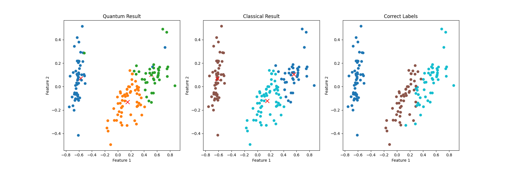

# Quantum program for Bachelor's thesis
This repository stores the program I have developed for the experiment in my Bachelor's thesis. The experiment aims to test the accuracy of the quantum k-means
clustering algorithm and quantum circuits for calculating Euclidean distance across different quantum platforms, including ideal simulators, noisy simulators, 
and real quantum systems. Below is an example of the experiment's results.

* Experiment 1: Quantum k-means clustering with an ideal simulator.
  
This experiment applies the quantum k-means clustering algorithm to cluster the Iris dataset into 3 and 2 clusters using a 30-qubit quantum circuit. The experiment
is executed on an IBM cloud-based ideal quantum simulator, which does not account for the noise factor present in real quantum systems. However, this cloud-based 
simulator can simulate a quantum circuit of up to 32 qubits, a capability significantly greater than that of a local computer's simulator. The program for running 
this experiment is in the [IBMSimulatorQuantumKMeansClustering](IBMSimulatorQuantumKMeansClustering.ipynb) file.
* Experiment 2: Quantum k-means clustering with a noisy simulator.

This experiment runs quantum k-means clustering algorithm to cluster 30 randomly chosen 2-dimensional Iris dataset into 2 clusters using 10-qubit quantum circuit.
The experiment is run on a noisy quantum simulator, which mimicked the behavior of a real quantum system and produced results with noise factor. The program 
for running this experiment is in this [NoisySimulatorQuantumKMeansClustering](NoisySimulatorQuantumKMeansClustering.ipynb) file.
* Experiment 3: Calculating Euclidean distance quantumly with a real quantum system.

This experiment evaluates the accuracy of a real quantum system in calculating Euclidean distance. The program for running this experiment is in the
[EuclideanDistanceEstimation](EuclideanDistanceEstimation.ipynb) file.  Due to the limited time for accessing IBM's real quantum system, the program for this experiment
has been kept as simple as possible and does not contain any descriptive text like the previous programs.

This summarizes the Bachelor's thesis experiment. The results of the experiment are published in the Bachelor's thesis, scheduled to be completed by May 1, 2024.
